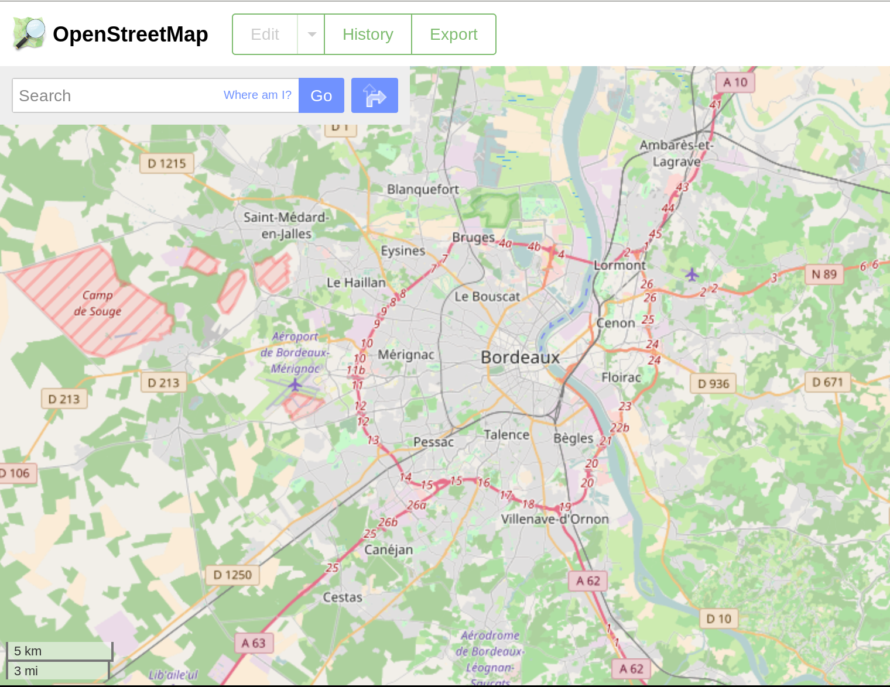
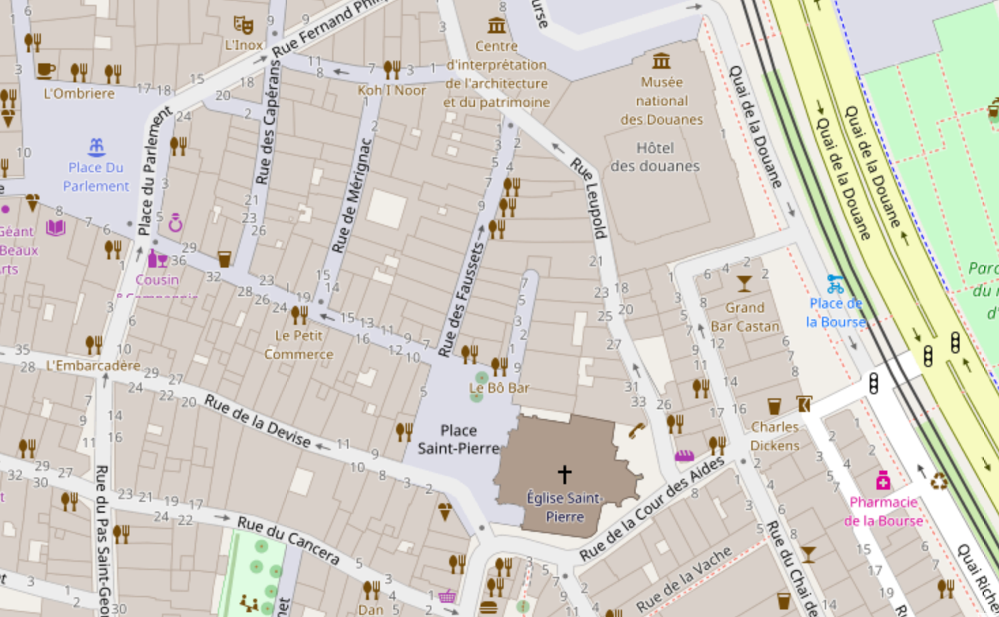
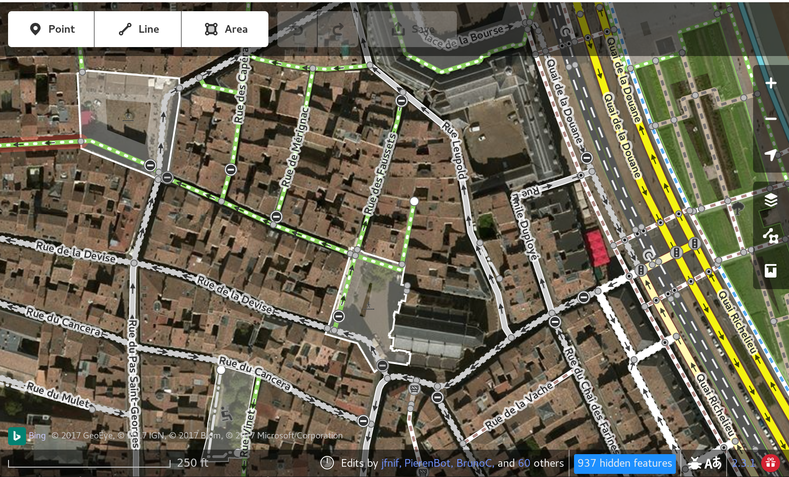

<center style="font-size: 2em;">
Évaluer la qualité des données OpenStreetMap
</center>

<center>
<u>Machine Learning Meetup</u>
</br>
<div style="font-size: 0.9em">Bordeaux &ndash; Node</div>
2019-01-24
</br>
<div style="font-size: 0.8em">Damien Garaud &ndash; damien.garaud@oslandia.com
</div>
</center>

---

## À propos

* Damien Garaud aka [@jazzydag](https://twitter.com/jazzydag)

* Programmer & Data Scientist

* Oslandia: **SIG**, Data, Simulation, 3D

 <div style="font-size: 0.7em;">Open Source, Télétravail, Intelligence
  collective, Open Data, <u>Machine Learning</u>, <u>PostgreSQL</u>,
  <u>PostGIS</u>, QGIS, <u>Python</u>, C++, JavaScript, Mapnik, OpenLayer,
  OpenStreetMap, Potree, three.js</div>

* https://github.com/garaud

---


---

<p style="font-size: 1.3em;">Articles à retrouver
sur [oslandia.com](http://oslandia.com) </p>

<center>
http://oslandia.com/en/category/data/
</center></br>

* [OpenStreetMap data analysis: introduction](http://oslandia.com/en/2017/06/19/openstreetmap-data-analysis-how-to-handle-it/)
* [Which data, how to get them](http://oslandia.com/en/2017/06/26/openstreetmap-data-presentation-which-data-how-to-get-them/)
* [How to parse the data with Python](http://oslandia.com/en/2017/07/03/openstreetmap-data-analysis-how-to-parse-the-data-with-python/)
* [How are OSM objects tagged](http://oslandia.com/en/2017/07/10/osm-tag-genome-how-are-osm-objects-tagged/)
* [Let's use machine learning](http://oslandia.com/en/2017/08/06/osm-user-classification-lets-use-machine-learning/)

<u>Code source</u>

https://github.com/Oslandia/osm-data-classification

---

<b><u style="font-size: 1.2em;">OpenStreetMap</u></b>

Données géographiques libres (Licence [ODbL](https://fr.wikipedia.org/wiki/Open_Database_License))


---

* Collaboratif "à la Wikipédia"

* +800,000 contributeurs

* des dizaines de millions de données
  - routes
  - bâtiments
  - points d'intérêt
  - ...

* Édition sur navigateur, sur mobile, ...

<center style="font-size: 0.8em;">https://openstreetmap.org</center>

---

### Intérêts

* Création de cartes, utilisation des données
* Libre, modifiable, réutilisable
* Utilisé par tous : particuliers, entreprises, collectivités, ONG
* *TaskForce* en cas de catastrophe naturelle

---

Agglomération de Bordeaux



----

Proche du Node, rue des faussets



----

Édition et fonds de carte satellite



---

### Plan

* Présentation des données OpenStreetMap *aka* **OSM**

* Problématique de la qualité de la donnée

* Récupérer les données historiques

* Apprentissage non supervisé

* L'importance du *features engineering*

---

### Type de données

* Node
* Way
* Relation

https://wiki.openstreetmap.org/wiki/Elements


----

<b style="font-size: 1.1em;">Node</b>

<div style="font-size: 0.7em">https://wiki.openstreetmap.org/wiki/Node</div> </br>

<div id="left">
<ul>
<li>Un point</li>
<li>Un id</li>
<li>Version</li>
<li>Des coordonnées lat/lon</li>
<li>Des tags</li>
</ul>
</div>

<div id="right">

</div>

----

<b style="font-size: 1.1em;">Way</b>

<div style="font-size: 0.7em;">https://wiki.openstreetmap.org/wiki/Way</div> </br>

<div id="left">
  <ul>
    <li>Une ligne (ouverte ou fermée)</li>
    <li>Une liste de nodes</li>
    <li>Un id</li>
    <li>Version</li>
    <li>Tags</li>
    <li>Bâtiments, routes, fleuves, voie férrée, ...</li>
  </ul>
</div>

<div id="right">
  
</div>

----

<b style="font-size: 1.1em;">Relation</b>

<div style="font-size: 0.7em;">https://wiki.openstreetmap.org/wiki/Relation
</br> Bordeaux http://www.openstreetmap.org/relation/105270</div>

<div id="left">
  <ul>
    <li>Un id</li>
    <li>Relation entre des éléments : nodes, ways ou d'autre relations</li>
    <li>Tags</li>
    <li>Exemples :</li>
      - frontière administrative
      - autoroute
  </ul>
</div>

<div id="right">
  </br>
  
</div>

----

<b style="font-size: 1.1em;">Tags</b>

<div style="font-size: 0.7em;">https://wiki.openstreetmap.org/wiki/Tags</div>

* Champs libre

* Clé / Valeur

* Conventions documentées

  - `name=rue des Faussets`
  - `highway=motorway`
  - `maxspeed=90`

----

### Conclusion sur les types de données

* Simple... mais puissant

* Forme géométrique simple ou complexe

* Aggrégation d'objets, contenu ou contenante

* Représentation d'objets très hétérogènes

<div style="font-size: 0.8em">
  une boîte au lettre, un restaurant, une mairie, un lac, un arbre, une route,
  un arrêt de tram, des stations de vélos, un parking, un mont, un banc, une
  sortie d'autoroute, des rails, aire de jeux, ...
</div>

Note: l'espèce de l'arbre, banc avec/sans dossier dossier, nombre de vélos

---

### Qualité de la donnée

Qualité de la donnée <b><u>géospatiale</u></b>

* Précision
* Topologie
* Complétude
* Sémantique

---

### Qualité de la donnée

Qualité de la donnée <b><u>géospatiale</u></b>


* <strike>Précision</strike>
* <strike>Topologie</strike>
* <strike>Complétude</strike>
* **Sémantique** (~meta-donnée)


<div style="font-size: 0.7em;">https://wiki.openstreetmap.org/wiki/Quality_assurance</div>

----

### Qualité dans OSM

* Collaboratif
* Tout le monde peut modifier
* Historique des données (depuis ~2006)
* Type de modification
* Classification des contributeurs

---

## Objectif

<div style="font-size: 1.3em;">On veut trouver un moyen de qualifier la
donnée</div>

---

### Attention Spoil !!

* Non supervisé

* Clustering via `KMeans`

* Capacité à classer / grouper les contributeurs (les changesets?)

* Au mieux : "débutant", "intermédiaire", "avancé" et "expert"

---

### La suite du plan


* <strike>Présentation des données OpenStreetMap</strike>
* <strike>Problématique de la qualité de la donnée</strike>
* **Récupérer les données historiques**
* Apprentissage non supervisé
* L'importance du *features engineering*

---

### Et les données, je les trouve où ?

Fichiers `.osm`  `.pbf`  `.osh`  `.shp`

* [Planet](http://planet.openstreetmap.org/)
* Région via [geofabrik](http://www.geofabrik.de/data/download.html)
* [Web API](https://wiki.openstreetmap.org/wiki/API_v0.6)

---

**Représentation** : *XML, XML everywhere!!*

<div style="font-size: 0.8em;">https://wiki.openstreetmap.org/wiki/OSM_XML</div>

```xml
<osm version="0.6"
     copyright="OpenStreetMap and contributors"
     attribution="http://www.openstreetmap.org/copyright"
     license="http://opendatacommons.org/licenses/odbl/1-0/">
 <way id="49331759" visible="true"
      version="15" changeset="44302389"
      timestamp="2016-12-10T12:45:06Z"
      user="Kalepom" uid="392288">
  <nd ref="626494306"/>
  <nd ref="626490950"/>
  <nd ref="626490951"/>
  <nd ref="597295106"/>
  <tag k="access" v="yes"/>
  <tag k="bicycle" v="yes"/>
  <tag k="cycleway" v="lane"/>
  <tag k="foot" v="no"/>
  <tag k="highway" v="tertiary"/>
  <tag k="maxspeed" v="50"/>
  <tag k="surface" v="asphalt"/>
 </way>
</osm>
```

---

### Parsing de fichier historique

* Fichier `*.osh.pbf` (et pas `osm`)
* Protocol Buffer
* Tout l'historique de tous les éléments, version par version
* Bibliothèque `pyosmium` (dispo sur [Pypi](https://pypi.python.org/pypi/osmium))

---

<div style="font-size: 0.8em">Classe `StatHandler`</div>

```python
import osmium

class StatHandler(osmium.SimpleHandler):
    def __init__(self):
        super(StatHandler, self).__init__()
        self.stat = {"node": 0,
                     "way": 0,
                     "relation": 0}

    def node(self, n):
        if n.version == 1:
            self.stat['node'] += 1

    def way(self, w):
        if w.version == 1:
            self.stat['way'] += 1

    def relation(self, r):
        if r.version == 1:
            self.stat['relation'] += 1
```

<a style="font-size: 0.7em;"
href="https://wiki.openstreetmap.org/wiki/OSM_XML">Autres exemples sur Github</a>

----

<div style="font-size: 0.8em">Classe `StatHandler` (suite)</div>

```python
handler = StatHandler()

# parse the file: each node, way and relation
handler.apply_file("osm_filepath.osh.pbf")

# print some stats
print(handler.stat)
```

affiche

```javascript
{'node': 2350780,
 'relation': 5333,
 'way': 403224}
```

<div style="font-size: 0.7em">Exemple sur l'agglo de Bordeaux, données historiques</div>

---

### Quelles méta-données récupérées ?

* Attributs de chaque élément
* Date, version
* User id
* Changeset id
* Élements effacés, ajoutés, modifiés

---

### Exemple

|   id | type     | version | n_user | visible | n_tags |
|:----:|:--------:|:-------:|:------:|:-------:|:------:|
|    7 | node     |       2 |      2 | false   |      1 |
| 1337 | node     |       2 |      1 | true    |      0 |
|   42 | way      |       6 |      4 | true    |      4 |
| 2046 | way      |       3 |      3 | true    |      3 |
|  103 | relation |      2  |      1 | false   |     2  |
| 5034 | relation |      10 |      7 | true    |     10 |

<div style="font-size: 0.7em">Autres éléments : date de création, dernière date
de modification, valeurs des tags, id des contributeurs, des changesets,
autocorrigé, etc.</div>

Note: on passe l'analyse de ces données, qu'il faut faire de toute façon

---

### Traitement et préparation des données

1. Récupération des données historiques
2. Traitement(s)
3. Enrichissement : changesets, éditeurs, ...
4. Normalisation
5. Analyse en Composantes Principales (PCA)
6. Clustering via `KMeans`
7. Production des résultats

Utilisation très forte de [luigi](http://luigi.readthedocs.io/en/stable/) +
[pandas](http://pandas.pydata.org/) + [scikit-learn](http://scikit-learn.org/)

---

### Conclusion pour cette partie

* Bien connaître les données et méta-données d'OSM
* Assez facile d'extraire des données historiques
* Je passe l'analyse de ces données brutes (qu'il faut faire !)
* Suite : apprentissage non supervisé

---

### Apprentissage non supervisé

* <strike>PCA</strike>
* Méthode de *clustering*
* Rassembler les contributeurs
* Extraire des profils
* `KMeans` par le `scikit.learn`

---

### Simple comme 'bonjour'

```python
from sklearn.cluster import KMeans

# You've some 'X' input data somewhere
model = KMeans(n_clusters=5)
labels = model.fit_predict(X)
```

---

### Le naïf

Je prends les données, je *clusterise* et je suis déçu :(

| cluster id |  pop | ratio |
|------------|------|-------|
|          0 | 2059 | +99%  |
|          1 |    3 | 0.14% |
|          2 |    1 | <0.1% |
|          3 |    1 | <0.1% |
|          4 |    9 |  0.4% |

----

J'ai pourtant normalisé

```python
import pandas as pd
from sklearn.preprocessing import StandardScaler

metadata = pd.read_csv('user-metadata.csv')
scaler = StandardScaler()

# scaling / normalization
X = scaler.fit_transform(metadata.values)

# KMeans
labels = km.fit_predict(X)

# Count the number of users for each cluster
s = pd.Series(labels)
s.groupby(s).count().sort_values()
```

---

### Revenons quand même un peu à l'analyse

 | stat | n_activity_days | n_total_modif |
 |-----:|:---------------:|:--------------|
 | mean |             5 |        1668   |
 | std  |            26 |       21725   |
 | min  |             1 |           1   |
 | 50%  |             1 |           5   |
 | max  |           866 |      644338   |

Cohorte de 2073 contributeurs

----


----


----

### Problèmes potentiels

* Population écrasante de faibles contributions

* Une très longue queue de distribution

* Des *outliers* impressionnants

---

### Soyons plus malin

* Ratio

* CDF (Cumulative Distribution Function) empirique

----

### Ratio

Création de `ways` : crées, effacées, mises à jour à jour, etc.

| uid | create | update | delete | total |
|-----|----|----|-----|-------|
|  12 | 1  | 2  |  2  |  5    |
|  45 | 5  | 5  |  2  |  12   |
| 106 | 2  | 1  | 0   |   3   |

----

### Ratio

| uid | create | update | delete |
|-----|--------|--------|--------|
|  12 | 1/5    | 2/5    | 2/5    |
|  45 | 5/12   | 5/12   | 2/12   |
| 106 | 2/3    | 1/3    | 0      |

Pour les **tous** *nodes*, *ways*, et *relations*

----

x

---

### CDF empirique

* Fonction de répartition empirique

* `P(X < x)`

* Meilleure répartition des cohortes par type d'éléments modifiés ?

----


----


---

### Le mot-clé

<div style="font-size: 1.5em;"><center>Feature Engineering</center></div>

---

### Scaling

`Normalizer`, `StandardScaler`, `RobustScaler`, `MinMaxScaler`


[Compare the effect of different scalers on data with outliers](http://scikit-learn.org/stable/auto_examples/preprocessing/plot_all_scaling.html) (doc
scikit-learn)

----

### RobustScaler

> Typically this is done by removing the mean and scaling to unit variance. However, outliers can often influence the sample mean / variance in a negative way.


[sklearn.preprocessing.RobustScaler](http://scikit-learn.org/stable/modules/generated/sklearn.preprocessing.RobustScaler.html)

---

### Résultat final

```python
import pandas as pd
from sklearn.preprocessing import RobustScaler

# Features with ratio and CDF
metadata = pd.read_csv('user-metadata-norm.csv')
scaler = RobustScaler(quantile_range=(0.0, 100.0))

# scaling
X = scaler.fit_transform(metadata.values)

# KMeans
labels = km.fit_predict(X)

# Count the number of users for each cluster
s = pd.Series(labels)
s.groupby(s).count().sort_values()
```

----

### Clusters

| cluster id | pop | ratio |
|------------|-----|-------|
|          0 | 437 | 21.0% |
|          1 | 587 | 28.3% |
|          2 | 240 | 11.5% |
|          3 | 471 | 22.7% |
|          4 | 338 | 16.3% |

----


----


---

### C'est quoi ton groupe ?

* Débutant, intermédiaire, expert ?

* Ça serait trop facile

* PCA pour analyser les *features* les plus "importantes"

----

### Groupe 0

* contributeurs plus récents
* activité modérée
* beaucoup de contributeurs locaux
* surtout de la création, amélioration de `node`

----

### Groupe 1

* modification de `relation` (très peu les autres types)
* surtout de la mise à jour (pas de création)
* de vieilles contributions

----

### Groupe 2

* plus de modification que la moyenne
* surtout pour améliorer des `ways` qui n'ont pas été modifiées/améliorées depuis.
* Durée de vie très courte.

----

### Groupe 3

* vieilles contributions
* création et mises à jour de `nodes` dont la majeur partie a été modifiée /
  corrigée depuis

----

### Groupe 4

* "expert" +90% des changements de la région
* tout type d'éléments OSM
* beaucoup de contributions "partout"
* tout type d'opération (création, effacement, etc.)
* s'auto-corrige contrairement aux autres

---

### Exemple de Cartes

* Identifier les éléments OSM par cluster

* Éléments OSM qui méritent plus d'attention ?

* Des routes par exemple

* Fait avec QGIS

----


Note: routes par version


----


Note: routes par cluster

---

### Plus loin

* Cluster de type différent par région

* Entrainer sur une région et appliquer sur l'autres

* Ranker les éléments OSM en fonction de ce classement

---

### Luigi Pipeline

* Juste besoin d'un fichier d'entrée `osh.pbf`
* Analyse de la variance pour choisir le nombre de composantes
* Analyse de KMeans avec k=1,2,..K pour sélectionner le nombre de clusters en
  automatique
* Modulable si l'on veut passer explicement `n_components` ou `n_clusters`
* KMeans avec données brutes ou avec PCA
* Production de courbes, scatter plot et heatmap

---

### Conclusion

Libs utilisées: pyosmium, luigi, pandas, numpy, sklearn, seaborn, statsmodels,
matplotlib

Rappel : http://oslandia.com/en/category/data/

<u>Code source</u>

https://github.com/Oslandia/osm-data-classification

---

### Plus récents avec (parfois) du OSM dedans

Détection de bâtiments


Injection de données OSM pour l'entrainement (deep learning)

----

Étalement urbain / densité de population. Collaboration labo Inria.


---

**Merci !**


